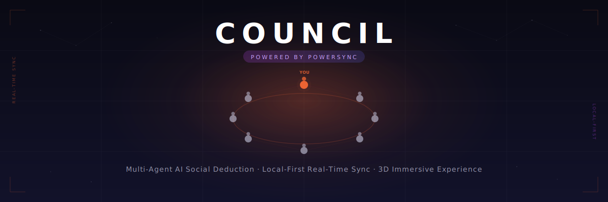
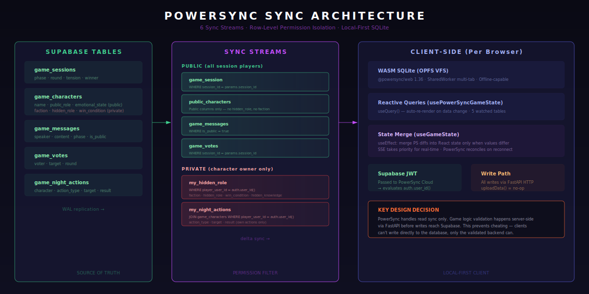
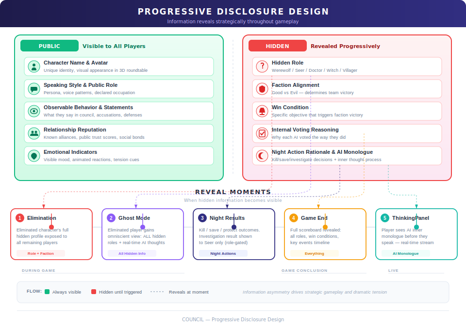
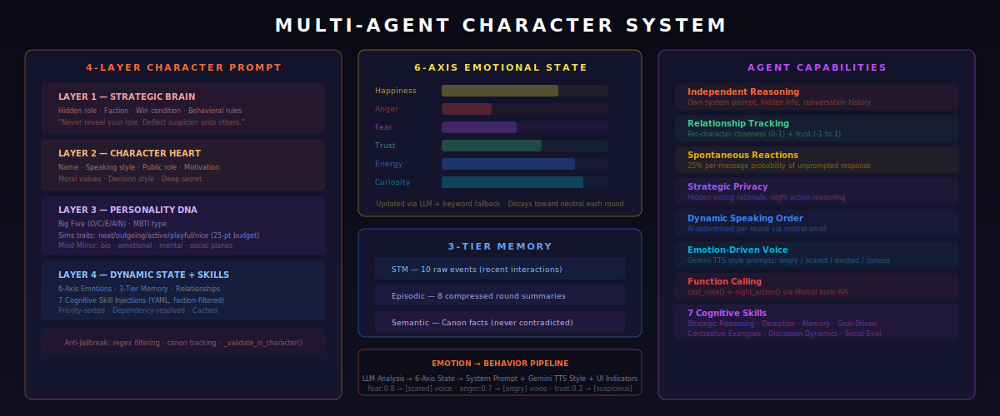
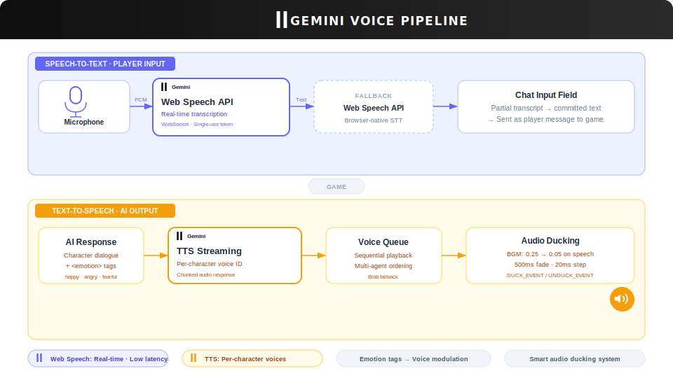
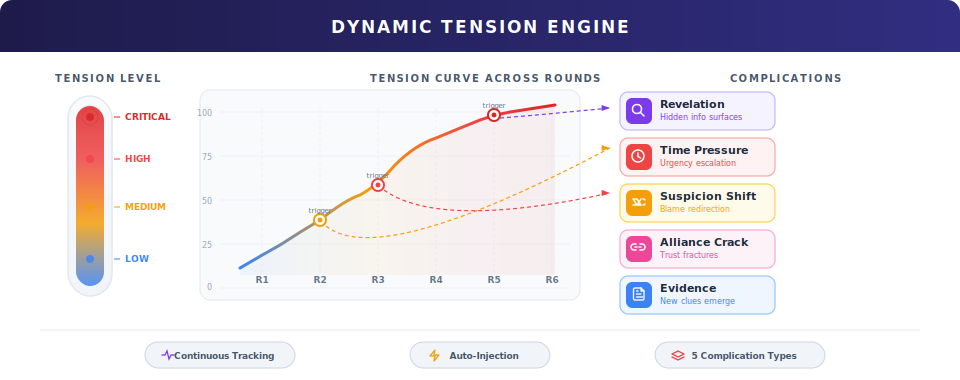
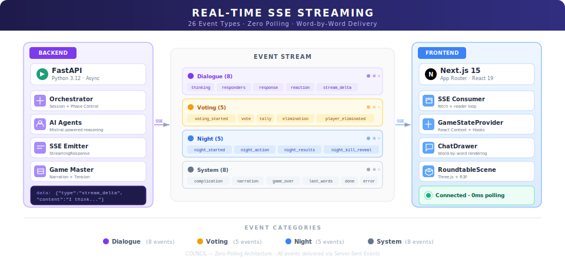
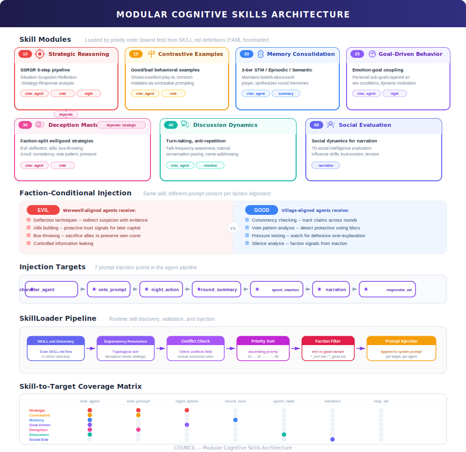

<div align="center">



<br/>

**Every civilization, every story, every conflict — strip it down and you find the same structure: good against evil, a savior, a killer, and the crowd in between.**
**COUNCIL is that structure, alive. Feed it any document and it spawns a network of AI agents that observe, communicate, and conspire — each carrying hidden agendas, evolving memories, and shifting loyalties. You infiltrate as one of them — and they don't know you're human.**

<br/>


<br/>

[](https://python.org)
[](https://fastapi.tiangolo.com)
[](https://nextjs.org)
[](https://react.dev)
[](https://threejs.org)
[](https://tailwindcss.com)
[](https://supabase.com)
[](https://docs.pydantic.dev)
[](#-license)

---

[What is COUNCIL](#what-is-council) · [Features](#-features) · [PowerSync Architecture](#-powersync-local-first-architecture) · [How It Works](#-how-it-works) · [Multi-Agent System](#-multi-agent-system) · [Mistral AI](#-powered-by-mistral-ai) · [Gemini TTS](#-powered-by-gemini-tts) · [Real-Time Streaming](#-dual-real-time-channels) · [Skills Architecture](#-modular-skills-architecture) · [Architecture](#-system-architecture) · [Quick Start](#-quick-start) · [API Reference](#-api-reference)

</div>

---

## What is COUNCIL?

COUNCIL is a **local-first, real-time multiplayer** AI social deduction game that transforms any document into a fully playable experience with autonomous AI characters. Powered by **Mistral AI** for character cognition, **Gemini 2.5 Flash** for voice synthesis, and **PowerSync** for seamless offline-capable data synchronization, it creates 5–8 AI agents — each with a unique personality, hidden role, and evolving agenda — that debate, deceive, form alliances, and eliminate each other around a 3D virtual roundtable.

**You join as a hidden player.** The AI characters don't know you're human. Can you survive the council?

### The Core Innovation

Most AI games give you a chatbot to talk to. COUNCIL gives you a **society of agents** with **competing hidden agendas** — and every piece of game state lives in a **local SQLite database** synced in real time via PowerSync. No API polling. Instant UI updates. Offline-capable.

> **Upload a PDF** about medieval court intrigue → AI generates Lords, Merchants, and Assassins, each with era-appropriate speech, hidden loyalties, and secret plots.
>
> **Paste a sci-fi excerpt** → Characters become space station crew members hunting a saboteur — voiced by Gemini TTS, animated in 3D, with memories of what every other character has said.
>
> **Pick a built-in scenario** → Jump straight into classic social deduction with pre-designed worlds.

---

## ✦ Features

| Feature | Description |
|---------|-------------|
| **Local-First Sync** | PowerSync syncs game state to a local WASM SQLite database (OPFS VFS). Instant reads, offline capability, automatic reconnect — zero API polling for state. |
| **Document-to-Game Engine** | Upload any PDF or text. Mistral AI extracts the world, factions, roles, and win conditions automatically via adaptive OCR + structured extraction. |
| **Autonomous AI Characters** | Each character has a 4-layer personality (Big Five, MBTI, Sims traits, Mind Mirror), 6-axis emotional state, persistent 3-tier memory, and per-character relationship tracking. |
| **Hidden Role Gameplay** | Secret factions (Good vs. Evil), asymmetric night actions (Kill / Investigate / Protect / Poison), strategic voting with hidden AI reasoning. |
| **Permission-Isolated Sync** | 6 PowerSync sync streams with row-level filtering — hidden roles sync only to the owning player via `auth.user_id()`. Other players never receive private data. |
| **Real-Time Voice** | Gemini 2.5 Flash TTS gives each character a unique voice (8-voice pool: Kore, Puck, Charon, Aoede, etc.) with emotion-modulated delivery via style prompts. |
| **3D Roundtable** | Immersive Three.js scene with animated character avatars, phase-reactive lighting, dynamic camera tracking, floating particles, and atmospheric effects. |
| **7 Modular Skills** | SKILL.md-defined cognitive modules with YAML frontmatter, dependency resolution, faction-conditional injection, and priority-ordered prompt augmentation. |
| **Tension Engine** | Dynamic tension tracking with narrative complication injection — revelations, time pressure, suspicion shifts, alliance cracks, and evidence keep every session unpredictable. |
| **Streaming Everything** | SSE streams 27 distinct event types — AI dialogue, votes, night results, complications — word-by-word to the frontend in real time. |
| **Ghost Mode** | Eliminated players become spectators who can see all hidden roles and AI inner thoughts. |

---

## ✦ PowerSync Local-First Architecture

<div align="center">

</div>

PowerSync is the **core data synchronization layer** — not an add-on. Every client reads from a local SQLite database that stays in sync with the server via PowerSync's incremental WAL replication.

### 6 Sync Streams with Permission Isolation

| Stream | Source Table | Audience | Filter |
|--------|-------------|----------|--------|
| `game_session` | `game_sessions` | All session players | `session_id = params.session_id` |
| `public_characters` | `game_characters` | All session players | Public columns only — no hidden_role, no faction |
| `my_hidden_role` | `game_characters` | Character owner only | `player_user_id = auth.user_id()` |
| `game_messages` | `game_messages` | All session players | `is_public = true` |
| `game_votes` | `game_votes` | All session players | `session_id = params.session_id` |
| `my_night_actions` | `game_night_actions` | Acting player only | JOIN `game_characters` WHERE `player_user_id = auth.user_id()` |

### Why This Matters for a Social Deduction Game

Social deduction games have a fundamental **information asymmetry problem**: players must have access to *some* shared state (chat, votes, eliminations) while *private* state (hidden roles, night actions) must be strictly isolated per player. PowerSync's sync rules solve this at the database level:

- **Public streams** push game state, character names, emotional indicators, chat messages, and vote records to all players
- **Private streams** use `auth.user_id()` to ensure hidden roles and night action results only reach the owning player
- **No client-side filtering** — the data simply never arrives at unauthorized clients

### Write Path Design

All writes go through **FastAPI HTTP endpoints**, not the PowerSync upload queue. The `SupabaseConnector.uploadData()` is intentionally a no-op. This ensures:

1. Game logic validation happens server-side before any data reaches the database
2. AI agent reasoning (Mistral function calling) is processed on the backend
3. No client can bypass game rules by writing directly to Supabase

### Offline & Reconnect

- Full game state cached in local SQLite via OPFS VFS
- Players can review messages, analyze voting patterns, and plan strategy offline
- Automatic reconciliation on reconnect — PowerSync catches up missed state changes
- Multi-tab support via SharedWorker when available
- COOP/COEP headers configured for SharedArrayBuffer compatibility

### Frontend Integration

```tsx
// PowerSync reactive queries drive the UI
const { gameSession, characters, messages, votes } = usePowerSyncGameState(sessionId);

// State merge: SSE for speed, PowerSync for reliability
useEffect(() => {
  if (ps.gameSession?.winner && ps.gameSession.winner !== session.winner) {
    setSession(prev => ({ ...prev, winner: ps.gameSession.winner }));
  }
}, [ps.gameSession]);
```

The `usePowerSyncGameState` hook runs 5 reactive SQL queries against the local SQLite database. When PowerSync receives new data from the server, queries re-execute automatically and React re-renders. Two `useEffect` hooks in `useGameState` merge PowerSync diffs into the primary React state — but only when values actually differ, preventing infinite update loops.

---

## ✦ How It Works

<div align="center">

</div>

### Phase-by-Phase Breakdown

| Phase | What Happens | Key Mechanic |
|-------|-------------|--------------|
| **Upload** | Drag-drop a PDF, paste text, or select a built-in scenario | Supports PDF, TXT, MD, DOC formats |
| **Generate** | Mistral AI extracts world model and creates 5–8 characters (~60s) | Adaptive OCR + structured JSON extraction |
| **Lobby** | Review character roster, world setting, and your secret role | PowerSync connects; role synced via `my_hidden_role` |
| **Discussion** | AI characters respond in-character, react spontaneously, form alliances | 25% spontaneous reaction chance; complication injection on stall |
| **Voting** | Parallel AI votes via `asyncio.gather()`; staggered reveal animation | Tie → Master Agent ruling via `make_ruling()` |
| **Reveal** | Eliminated character's hidden role exposed to all | Progressive disclosure via PowerSync broadcast |
| **Night** | Kill / Investigate / Protect / Poison via Mistral function calling | Results synced only to affected players via private streams |
| **Loop** | Cycle continues until a faction achieves its win condition | Round 6 cap; majority faction wins |

### Progressive Disclosure

<div align="center">

</div>

---

## ✦ Multi-Agent System

<div align="center">

</div>

### What Makes It a True Multi-Agent System

Unlike chatbot roleplay or single-NPC games, COUNCIL implements genuine multi-agent architecture:

| Property | Implementation |
|----------|---------------|
| **Independent reasoning** | Each agent has its own system prompt, hidden information, and conversation history |
| **Persistent memory** | 3-tier memory: STM (10 events), Episodic (8 round summaries), Semantic (canon facts) |
| **Relationship tracking** | Per-character `closeness` (0–1) and `trust` (-1 to 1) updated after every interaction |
| **Emotional evolution** | 6-axis emotions (happiness, anger, fear, trust, energy, curiosity) updated via LLM + keyword fallback; decays toward neutral each round |
| **Spontaneous reactions** | 25% per-message probability of unprompted NPC response — organic group dynamics |
| **Strategic privacy** | Hidden voting rationale and night action reasoning never shared with other agents |
| **Dynamic speaking order** | AI-determined per round via `mistral-small-latest` — not fixed turn order |

### The 4-Layer Character Prompt Architecture

Every AI character is constructed as a layered system prompt — a psychological model that separates what the character *shows* from what it *knows* and *wants*:

```
╔═══════════════════════════════════════════════════════════════╗
║  LAYER 1 — STRATEGIC BRAIN (hidden from all other agents)     ║
║  Hidden role · Faction · Win condition · Behavioral rules     ║
║  "Never reveal your role. Deflect suspicion onto others."     ║
╠═══════════════════════════════════════════════════════════════╣
║  LAYER 2 — CHARACTER HEART (public persona)                   ║
║  Name · Speaking style · Public role                          ║
║  Want · Method · Moral values · Decision style · Deep secret  ║
╠═══════════════════════════════════════════════════════════════╣
║  LAYER 3 — PERSONALITY DNA                                    ║
║  Big Five (O/C/E/A/N) · MBTI type                            ║
║  Sims traits: neat/outgoing/active/playful/nice (25-pt budget)║
║  Mind Mirror (Leary's 4 planes): bio · emotional · mental ·  ║
║  social → Each plane generates unique behavioral "jazz"       ║
╠═══════════════════════════════════════════════════════════════╣
║  LAYER 4 — DYNAMIC STATE + SKILL INJECTIONS                  ║
║  Emotional state: happiness·anger·fear·trust·energy·curiosity ║
║  Memory: STM (10 events) · Episodic (8 summaries) · Semantic ║
║  Relationships: per-character closeness (0-1) + trust (-1,1)  ║
║  + 7 Skill Injections (YAML frontmatter, faction-filtered)    ║
╚═══════════════════════════════════════════════════════════════╝
```

---

## ✦ Powered by Mistral AI

Mistral AI is the **cognitive backbone** of COUNCIL. Every character thought, strategic decision, and narrative beat is driven by Mistral's model suite.

### Model Usage Map

| Task | Model | Technique | Why This Model |
|------|-------|-----------|----------------|
| Document OCR | `mistral-ocr-latest` | Adaptive sizing: direct (<50K) or hierarchical chunk→summarize→combine | Best-in-class OCR for mixed PDF/text |
| World extraction | `mistral-large-latest` | JSON mode + Pydantic v2 validation | Complex structured reasoning over arbitrary narratives |
| Character generation | `mistral-large-latest` | Multi-field JSON schema; 3 retries + exponential backoff | Coherent multi-dimensional personality synthesis |
| In-character dialogue | `mistral-large-latest` | SSE streaming; 4-layer system prompt with skill injections | Narrative quality + persona fidelity |
| Strategic voting | `mistral-large-latest` | **Function calling**: `cast_vote(target_id, reasoning)` | Structured output with hidden reasoning |
| Night actions | `mistral-large-latest` | **Function calling**: `night_action(action_type, target_id, reasoning)` | Role-aware structured decisions |
| Narration | `mistral-large-latest` | Narrative templates + complication injection | Creative generation with phase awareness |
| Responder selection | `mistral-small-latest` | JSON: which characters should respond | Low-latency filtering before generation |
| Speaking order | `mistral-small-latest` | JSON: dynamic character ordering per round | Cost-efficient coordination |
| Emotion analysis | `mistral-small-latest` | JSON: 6-axis emotional state update | Frequent updates, fast cheap model |
| Round summaries | `mistral-small-latest` | Discussion compression for agent memory | Cost-efficient long-term memory |
| Tie-breaking | `mistral-large-latest` | "Master Agent" with full context → revote / skip / custom | High-stakes decisions need most capable model |

### Mistral Function Calling in Action

COUNCIL uses Mistral's **function calling API** for the game's most critical structured decisions:

```python
GAME_TOOLS = [
    {
        "type": "function",
        "function": {
            "name": "cast_vote",
            "description": "Vote to eliminate a player from the council",
            "parameters": {
                "properties": {
                    "target_id": {"type": "string"},
                    "reasoning": {"type": "string",
                                  "description": "Internal reasoning (hidden from others)"},
                },
                "required": ["target_id", "reasoning"]
            }
        }
    },
    {
        "type": "function",
        "function": {
            "name": "night_action",
            "parameters": {
                "properties": {
                    "action_type": {
                        "type": "string",
                        "enum": ["kill", "investigate", "protect", "save", "poison", "none"]
                    },
                    "target_id": {"type": "string"},
                    "reasoning": {"type": "string"}
                }
            }
        }
    }
]
```

### Anti-Jailbreak Defense

Characters are hardened against prompt injection, personality drift, and AI self-disclosure:

- **Behavioral rules** enforced at Layer 1 of the system prompt
- **Pattern-based filtering**: regex detection of AI-like phrases ("As an AI", "language model", etc.)
- **Canon fact tracking**: characters never contradict their own stated history
- **`_validate_in_character()`** response gating on every generation
- **AI phrase stripping** applied to all output before delivery

---

## ✦ Powered by Gemini TTS

<div align="center">

</div>

Gemini 2.5 Flash TTS transforms COUNCIL from a text game into a **cinematic experience**. Characters don't just respond — they speak in distinct voices that carry emotion.

### Voice Architecture

| Feature | Implementation | Details |
|---------|---------------|---------|
| **Text-to-Speech** | Gemini 2.5 Flash TTS (REST API) | Each character mapped to a unique voice from an 8-voice pool (Kore, Puck, Charon, Aoede, Leda, Orus, Zephyr, Fenrir). WAV output (24kHz, 16-bit, mono PCM). |
| **Emotion Styling** | Automatic prompt injection | 6-axis emotional state → Gemini style instructions: "Say this angrily", "Say this fearfully", "Say this with excitement" |
| **Audio Ducking** | Custom events | BGM fades when characters speak. Phase-aware volumes: night (0.15), discussion (0.25), voting (0.35). |

### Emotion-Driven Voice Delivery

Every character response is analyzed by a 6-dimensional emotional model *before* TTS. The `inject_emotion_tags()` function prepends Gemini-compatible style instructions:

- A character with `fear: 0.8` after being accused → "Say this fearfully, with a trembling voice"
- A Werewolf deflecting with `trust: 0.2` → "Say this suspiciously, with doubt in your voice"
- A Doctor who saved someone overnight, `happiness: 0.8` + `energy: 0.7` → "Say this with excitement and energy"

---

## ✦ Dynamic Tension Engine

<div align="center">

</div>

The **Tension Engine** continuously tracks the emotional temperature of the game and dynamically injects narrative complications when discussion stalls, consensus forms too quickly, or a faction is cruising without opposition.

### How Tension Is Calculated

```
tension = f(elimination_ratio, round_progression, recent_kills, vote_splits, silence_duration)
```

### 5 Complication Types

| Complication | Trigger | In-Game Effect |
|-------------|---------|----------------|
| **Revelation** | Hidden information surface | "Someone's story doesn't add up — a detail contradicts what was said two rounds ago." |
| **Time Pressure** | Urgency escalation | "The council demands decisive action NOW. No more deliberation." |
| **Suspicion Shift** | Blame redirection | "Eyes turn toward someone who has been suspiciously silent." |
| **Alliance Crack** | Trust fractures | "Two allies exchange a tense glance — something unspoken hangs between them." |
| **Evidence** | New clues emerge | "A piece of evidence is discovered that changes everything." |

Complications are **non-repeating within a session** and escalate in intensity as rounds progress.

---

## ✦ Dual Real-Time Channels

<div align="center">

</div>

COUNCIL uses two complementary real-time systems in parallel:

### SSE Streaming (Primary — Game Events)

**Server-Sent Events** deliver every game interaction word-by-word with zero polling.

#### 27 Event Types Across 4 Categories

| Category | Events | Purpose |
|----------|--------|---------|
| **Dialogue** (8) | `thinking`, `ai_thinking`, `responders`, `stream_start`, `stream_delta`, `stream_end`, `response`, `reaction` | Word-by-word AI character speech with thinking indicators |
| **Voting** (5) | `voting_started`, `vote`, `tally`, `elimination`, `player_eliminated` | Staggered vote reveals with dramatic pacing |
| **Night** (6) | `night_started`, `night_action`, `night_action_prompt`, `night_results`, `night_kill_reveal`, `investigation_result` | Secret actions resolved with cinematic reveals |
| **System** (8) | `complication`, `narration`, `discussion_warning`, `discussion_ending`, `game_over`, `last_words`, `error`, `done` | Game flow control and narrative injection |

### PowerSync (Persistent — State Reconciliation)

PowerSync maintains the **authoritative persistent state** as a background sync layer:

```
Backend write → Supabase → WAL → PowerSync Cloud → Client SQLite → useQuery() → React
```

### How They Work Together

| Concern | SSE | PowerSync |
|---------|-----|-----------|
| LLM token streaming | Primary | — |
| Vote reveal animation | Primary | — |
| Character elimination status | — | Primary |
| Game phase/round/tension | Immediate delivery | Authoritative reconciliation |
| Chat message history | Immediate delivery | Persistent storage |
| Offline recovery | — | Full state catchup |
| Multi-tab consistency | — | SharedWorker sync |

**SSE for speed, PowerSync for reliability.**

---

## ✦ Modular Skills Architecture

<div align="center">

</div>

COUNCIL implements a **modular cognitive skills system** — 7 SKILL.md-defined skill modules that augment agent intelligence at runtime through dependency-resolved, faction-conditional prompt injection.

### The 7 Cognitive Modules

| # | Skill | Priority | What It Adds |
|---|-------|----------|-------------|
| 1 | **Strategic Reasoning** | 10 | SSRSR 5-step pipeline: Situation → Suspicion Map → Reflection → Strategy → Response |
| 2 | **Contrastive Examples** | 15 | Good/bad behavioral examples via in-context learning |
| 3 | **Memory Consolidation** | 20 | 3-tier memory system: STM → Episodic → Semantic |
| 4 | **Goal-Driven Behavior** | 25 | Emotion-goal coupling: fear drives survival, curiosity drives investigation |
| 5 | **Deception Mastery** | 30 | **Faction-split**: Evil → deflection, alibi building; Good → consistency checking, vote analysis |
| 6 | **Discussion Dynamics** | 40 | Turn-taking, anti-repetition, energy matching |
| 7 | **Social Evaluation** | 60 | Social dynamics awareness for Game Master narration |

### Faction-Conditional Injection

The same skill module produces **fundamentally different agent behavior** based on faction:

<table>
<tr>
<th>Evil Agent (Deception Mastery)</th>
<th>Good Agent (Deception Mastery)</th>
</tr>
<tr>
<td>

**Deflection**: Redirect suspicion with evidence against someone else

**Alibi Building**: Vote with majority early to build trust for later betrayal

**Bus-Throwing**: If an evil ally is exposed, join the accusation to maintain cover

**Controlled Information**: Share just enough to seem helpful

</td>
<td>

**Consistency Check**: Track claims across rounds — liars contradict themselves

**Vote Pattern Analysis**: Evil players vote together — look for protection blocs

**Pressure Testing**: Direct questions + watch reactions — over-explanation is a tell

**Silence Analysis**: Players quiet during critical moments may be avoiding risk

</td>
</tr>
</table>

### The SkillLoader Pipeline

```
SKILL.md Discovery → Dependency Resolution (DFS) → Conflict Detection
         ↓
Priority Sort → Faction Filter (_evil.md / _good.md) → Prompt Injection
         ↓
Cached per (skill, target, faction) tuple
```

---

## ✦ System Architecture

<div align="center">

</div>

### Stack Overview

| Layer | Technology | Role |
|-------|-----------|------|
| **Frontend** | Next.js 15 · React 19 · TypeScript | App shell, routing, game state via React Context |
| **3D Scene** | Three.js ~0.175 · React Three Fiber · @react-three/drei | Roundtable, animated agents, dynamic camera, phase lighting |
| **Styling** | Tailwind CSS 4 | Responsive UI with phase-themed dark design |
| **Sync** | @powersync/web 1.36 · @powersync/react 1.9 | Local-first SQLite, 6 sync streams, OPFS VFS |
| **Auth** | Supabase Auth | Anonymous + email login, JWT for PowerSync + API |
| **Backend** | Python 3.12 · FastAPI | REST + SSE streaming API, async game orchestration |
| **LLM Engine** | Mistral AI SDK | All character cognition, world generation, voting, narration |
| **Voice** | Gemini 2.5 Flash TTS (REST API, no SDK) | TTS with emotion style prompts, 8-voice pool |
| **Database** | Supabase PostgreSQL | 5 game tables, RLS enabled, WAL replication to PowerSync |
| **Cache** | Redis via Upstash (24h TTL, optional) | Agent conversation history cache |
| **Validation** | Pydantic v2 | All LLM response parsing with custom validators + retries |

### Dual-Layer Data Flow

```
Game Action (chat / vote / night)
    │
    ▼
FastAPI Backend ─── processes AI ──► SSE stream to client (real-time)
    │
    ▼
Supabase PostgreSQL ─── HOT LAYER
────────────────────────────────────
• Upsert via asyncio.to_thread (5 tables)
• RLS enabled, WAL replication active
• Source of truth for all game state
    │
    ▼ (WAL replication)
PowerSync Cloud ─── SYNC LAYER
────────────────────────────────
• 6 sync streams with permission filtering
• auth.user_id() for private data isolation
• Incremental delta sync to all clients
    │
    ▼
Client SQLite (OPFS) ─── LOCAL-FIRST
─────────────────────────────────────
• useQuery() reactive bindings
• Instant reads, zero network latency
• Offline-capable, auto-reconnect
    │
    ▼ (optional)
Redis / Upstash ─── CACHE LAYER
────────────────────────────────
• Agent conversation history
• 24h TTL per session
• Failure-tolerant (in-memory fallback)
```

### 3D Scene Engineering

The Three.js roundtable scene uses careful GPU resource management:

- **No React Strict Mode** — prevents double-mount GPU resource exhaustion
- **No PostProcessing** — eliminates EffectComposer framebuffers
- **No shadows** — removes shadow map allocations
- **No HDRI environment** — eliminates cubemap texture GPU load
- **three.js pinned to ~0.175.0** — compatibility with postprocessing library

Visual atmosphere achieved via `FloatingParticles` (100 fireflies, additive blending), `SciFiFloor` (reflective + concentric rings), emissive oscillating materials on agent figures, and 1500-particle `Stars`. Phase-reactive lighting dims ambient intensity by 0.03 per round, creating escalating darkness as the game progresses.

---

## ✦ Quick Start

### Prerequisites

- [Conda](https://docs.conda.io/en/latest/) (Miniconda or Anaconda)
- [Node.js](https://nodejs.org/) 18+
- [Mistral AI API key](https://console.mistral.ai/) — required
- [Supabase project](https://supabase.com) — required (database + auth)
- [PowerSync Cloud instance](https://www.powersync.com) — required (sync)
- [Gemini API key](https://aistudio.google.com/apikey) — optional (voice features)

### 1. Clone & Set Up

```bash
git clone <repo-url>
cd council

conda create -n council python=3.12 -y
conda activate council
```

### 2. Install Dependencies

```bash
# Backend
pip install -r requirements.txt

# Frontend
cd frontend && npm install && cd ..
```

### 3. Configure Environment

**Backend** (`.env` in project root):

```env
# Required
MISTRAL_API_KEY=your_mistral_api_key
SUPABASE_URL=https://your-project.supabase.co
SUPABASE_SERVICE_ROLE_KEY=your_service_role_key

# Voice (optional — text-only without this)
GEMINI_API_KEY=your_gemini_api_key

# Cache (optional — in-memory only without these)
REDIS_URL=rediss://your_upstash_redis_url
```

**Frontend** (`frontend/.env.local`):

```env
NEXT_PUBLIC_SUPABASE_URL=https://your-project.supabase.co
NEXT_PUBLIC_SUPABASE_ANON_KEY=your_supabase_anon_key
NEXT_PUBLIC_POWERSYNC_URL=https://your-instance.powersync.journeyapps.com
NEXT_PUBLIC_API_URL=http://localhost:8000
```

### 4. Database Setup

Create 5 tables in Supabase with RLS enabled:

| Table | Key Columns |
|-------|-------------|
| `game_sessions` | `session_id` (unique), `phase`, `round`, `tension_level`, `winner` |
| `game_characters` | `id` (PK), `session_id`, `player_user_id` (FK auth.users), `name`, `faction`, `hidden_role` |
| `game_messages` | `id` (PK), `session_id`, `speaker_id`, `content`, `is_public`, `phase` |
| `game_votes` | `id` (PK), `session_id`, `round`, `voter_id`, `target_id` |
| `game_night_actions` | `id` (PK), `session_id`, `round`, `character_id`, `action_type`, `target_id` |

Deploy the PowerSync sync rules from `powersync/sync-config.yaml` to your PowerSync Cloud instance.

### 5. Run

```bash
# Terminal 1 — Backend (FastAPI on :8000)
conda activate council
python run.py

# Terminal 2 — Frontend (Next.js on :3000)
cd frontend
npm run dev
```

Open **[http://localhost:3000](http://localhost:3000)** — sign in as guest or with email, then create a game.

---

## ✦ API Reference

All game interactions stream via SSE. Responses arrive word-by-word, vote-by-vote, action-by-action.

### Game Endpoints

| Endpoint | Method | Response | Description |
|----------|--------|----------|-------------|
| `/api/game/create` | POST | JSON | Create game from uploaded file or pasted text |
| `/api/game/scenario/{id}` | POST | JSON | Create game from a built-in scenario |
| `/api/game/{id}/start` | POST | JSON | Transition lobby → discussion; assign player role |
| `/api/game/{id}/join` | POST | JSON | Human player joins game, gets assigned a character |
| `/api/game/{id}/chat` | POST | SSE | Send message → stream of AI character responses |
| `/api/game/{id}/open-discussion` | POST | SSE | Trigger unprompted AI discussion round |
| `/api/game/{id}/vote` | POST | SSE | Cast vote → stream of staggered vote reveals |
| `/api/game/{id}/night` | POST | SSE | Trigger night phase → AI actions + player prompt |
| `/api/game/{id}/night-chat` | POST | SSE | Player night communication (ghost/role-specific) |
| `/api/game/{id}/night-action` | POST | SSE | Submit player's secret night action |
| `/api/game/{id}/state` | GET | JSON | Full game state (`?full=true` for recovery) |
| `/api/game/{id}/player-role` | GET | JSON | Get player's hidden role assignment |
| `/api/game/{id}/reveal/{char}` | GET | JSON | Get eliminated character's hidden profile |

### Voice Endpoints

| Endpoint | Method | Response | Description |
|----------|--------|----------|-------------|
| `/api/voice/tts` | POST | audio/mpeg | Generate character TTS audio |
| `/api/voice/tts/stream` | GET/POST | audio/mpeg (stream) | Stream TTS audio in chunks |
| `/api/voice/scribe-token` | POST | JSON | Mint single-use STT session token |
| `/api/voice/sfx` | POST | audio/mpeg | Generate sound effect |

### System Endpoints

| Endpoint | Method | Description |
|----------|--------|-------------|
| `/api/health` | GET | Health check |
| `/api/skills` | GET | List available cognitive skill modules |
| `/api/game/scenarios` | GET | List built-in game scenarios |
| `/api/auth/guest` | POST | Create auto-confirmed Supabase guest user |

---

## ✦ Project Structure

```
council/
├── backend/
│   ├── server.py                     # FastAPI app — 22 API routes
│   ├── game/
│   │   ├── orchestrator.py           # Session management, phase coordination, SSE
│   │   ├── game_master.py            # Narration, tension, voting, complications
│   │   ├── character_agent.py        # 4-layer prompt system, emotional AI engine
│   │   ├── character_factory.py      # LLM character generation (Sims + Mind Mirror)
│   │   ├── document_engine.py        # OCR → WorldModel adaptive pipeline
│   │   ├── skill_loader.py           # SKILL.md discovery, dependency resolution
│   │   ├── persistence.py            # Supabase (primary) + Redis (cache)
│   │   ├── state.py                  # Phase state machine + serialization
│   │   ├── prompts.py                # All prompt templates
│   │   └── skills/                   # 7 cognitive skill modules
│   │       ├── strategic_reasoning/  # SSRSR 5-step pipeline (P:10)
│   │       ├── contrastive_examples/ # Good/bad behavioral examples (P:15)
│   │       ├── memory_consolidation/ # 3-tier memory system (P:20)
│   │       ├── goal_driven_behavior/ # Emotion-goal coupling (P:25)
│   │       ├── deception_mastery/    # Faction-split deception/detection (P:30)
│   │       ├── discussion_dynamics/  # Turn-taking, anti-repetition (P:40)
│   │       └── social_evaluation/    # Social dynamics for narration (P:60)
│   ├── agents/
│   │   └── base_agent.py             # Mistral async base class
│   ├── models/
│   │   └── game_models.py            # Pydantic v2 data models (20 models)
│   └── voice/
│       └── tts_middleware.py          # Gemini TTS + emotion style injection
│
├── frontend/
│   ├── app/                          # Next.js App Router
│   │   ├── layout.tsx                # Root layout, fonts, PowerSync provider
│   │   └── page.tsx                  # Auth gate + GameRouter
│   ├── components/
│   │   ├── providers/
│   │   │   ├── ClientProviders.tsx   # SSR guard, dynamic import
│   │   │   └── PowerSyncProvider.tsx # WASM SQLite init + auth wiring
│   │   ├── GameBoard.tsx             # Main game interface + overlays
│   │   ├── VotePanel.tsx             # Staggered vote reveal animation
│   │   ├── NightActionPanel.tsx      # Role-specific night action UI
│   │   ├── GhostOverlay.tsx          # Spectator view with hidden roles
│   │   ├── ThinkingPanel.tsx         # AI inner thoughts display
│   │   ├── DocumentUpload.tsx        # Drag-drop + text + scenario selection
│   │   ├── GameLobby.tsx             # Character roster + role reveal
│   │   └── scene/                    # Three.js 3D roundtable
│   │       ├── RoundtableScene.tsx   # Canvas config + error boundary
│   │       ├── RoundtableCanvas.tsx  # Particles, floor, stars, agents
│   │       ├── AgentFigure.tsx       # Animated 3D characters
│   │       ├── CameraRig.tsx         # Dynamic camera follow
│   │       └── SceneLighting.tsx     # Phase-reactive atmospheric lighting
│   ├── hooks/
│   │   ├── useGameState.tsx          # Central game state + SSE consumer
│   │   ├── usePowerSyncGameState.tsx # PowerSync reactive SQL queries
│   │   ├── useRoundtable.tsx         # 3D scene state (speaking, camera, focus)
│   │   ├── useAuth.tsx               # Supabase Auth (anonymous + email)
│   │   ├── useVoice.ts              # TTS queue + audio playback
│   │   ├── useBackgroundAudio.ts    # Phase music + TTS ducking
│   │   └── useSFX.ts               # Sound effects (vote, eliminate, phase)
│   └── lib/
│       ├── api.ts                    # API calls + SSE stream parsers
│       ├── game-types.ts            # TypeScript types (27 event types)
│       ├── powersync.ts             # PowerSync schema (5 tables)
│       ├── powersync-connector.ts   # SupabaseConnector (no-op upload)
│       ├── supabase.ts              # Supabase client singleton
│       ├── scene-constants.ts       # 3D geometry + camera presets
│       ├── audio-manager.ts         # Managed audio playback singleton
│       └── agent-utils.ts           # Agent role → TTS ID mapping
│
├── powersync/
│   ├── sync-config.yaml             # 6 Sync Stream definitions
│   ├── service.yaml                 # Supabase replication config
│   └── cli.yaml                     # PowerSync Cloud project binding
│
├── run.py                            # Backend server launcher
└── requirements.txt                  # Python dependencies
```

---

## ✦ Research Foundations

| Foundation | Application in COUNCIL |
|-----------|----------------------|
| **SSRSR Pipeline** (xuyuzhuang-Werewolf) | Strategic Reasoning skill: Situation → Suspicion → Reflection → Strategy → Response |
| **Role-Strategy Heuristics** (LLMWereWolf) | Deception Mastery skill: faction-conditional behavioral strategies |
| **Leary's Interpersonal Circumplex** | Mind Mirror personality: 4 thought planes generating behavioral "jazz" |
| **Sims Personality Model** | 5 traits with 25-point budget modulating emotion probabilities |
| **Big Five + MBTI** | Multi-dimensional personality DNA for diverse character behavior |

---

## ✦ License

This project is licensed under the MIT License.

---

<div align="center">


<br/>

<a href="https://mistral.ai"></a>
<a href="https://www.powersync.com"></a>
<a href="https://aistudio.google.com"></a>
<a href="https://supabase.com"></a>

<br/>

**Built for the [PowerSync AI Hackathon](https://www.powersync.com)**

</div>
